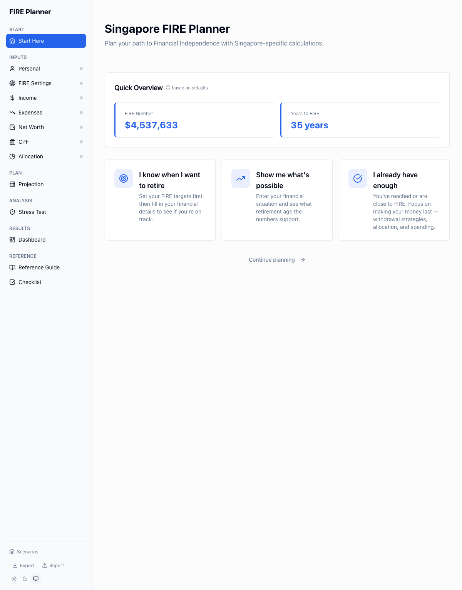
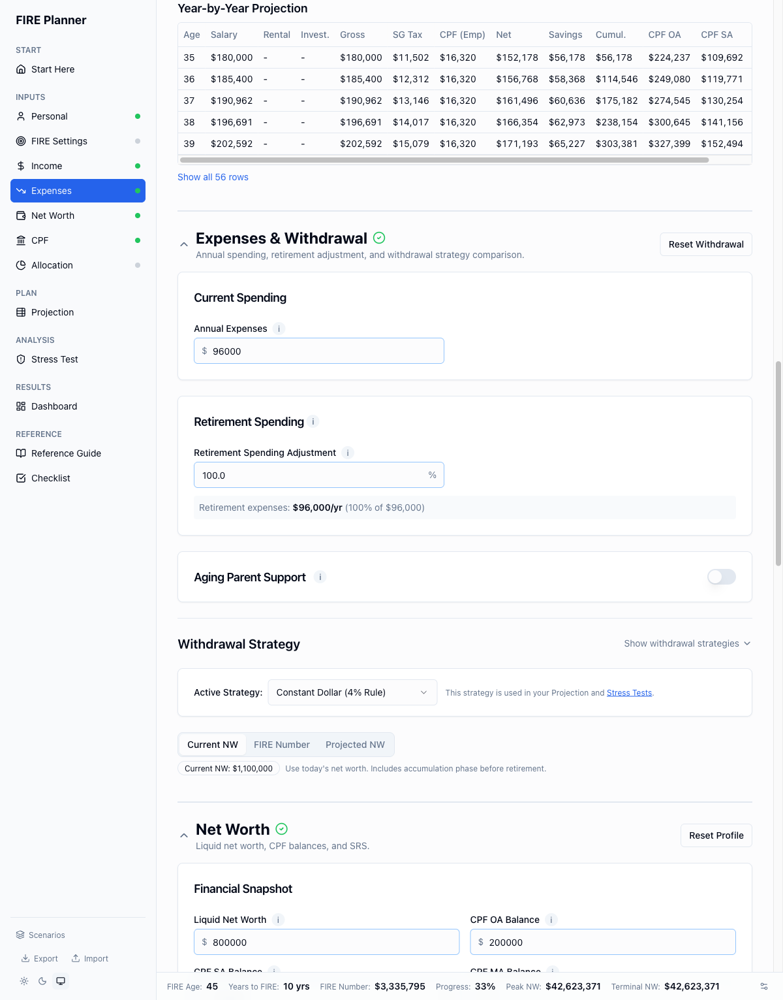
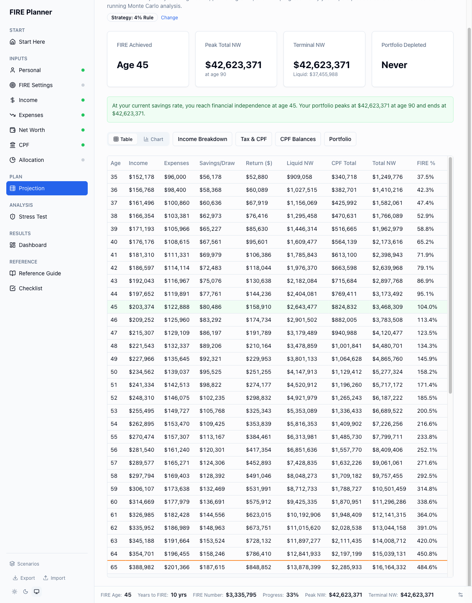
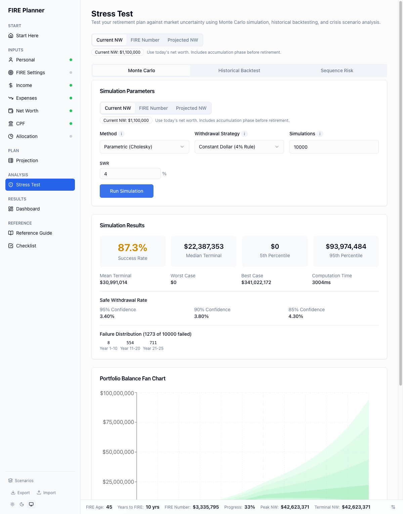
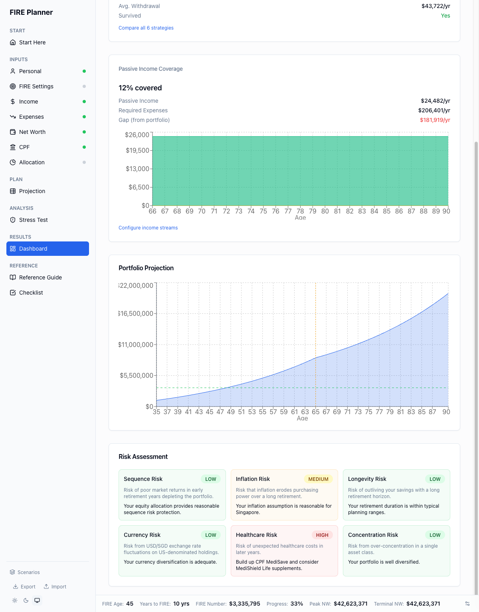

# fireplanner

A comprehensive FIRE (Financial Independence, Retire Early) planning tool built for Singapore residents. Runs entirely in your browser — no server, no accounts, no data leaves your device.

**[Try it live at sgfireplanner.com &rarr;](https://sgfireplanner.com)**



## Why fireplanner?

Most retirement calculators are too simple (multiply expenses by 25) or US-centric. fireplanner is built from the ground up for Singapore:

- **CPF integration** — contribution rates by age bracket, OA/SA/MA interest, extra interest on first $60K, BRS/FRS/ERS projections, CPF LIFE payouts
- **Singapore tax** — progressive income tax with personal reliefs, SRS deduction, employer CPF
- **Property analysis** — Bala's Table leasehold decay, BSD/ABSD, HDB monetization (subletting, right-sizing, Silver Housing Bonus)
- **SGD-denominated** — all values in Singapore dollars with historical USD/SGD conversion

## Features

### Inputs

Enter your financial situation across guided sections — income, expenses, net worth, CPF, asset allocation, financial goals, healthcare, and property.



- **Guided onboarding** — answer a few questions and get a pre-configured plan, or build from scratch
- **Income engine** — 3 salary models (simple growth, career phases, MOM benchmarks), multiple income streams, life events with disruption templates
- **Financial goals** — plan for wedding, education, housing, car, and other milestones with FIRE impact analysis
- **Asset allocation** — 8 asset classes with pre-built templates, Markowitz portfolio stats, correlation heatmap, glide path configuration
- **Healthcare planning** — MediShield Life, ISP, CareShield Life, out-of-pocket projections with age-curve modeling

### Year-by-Year Projection

See your full financial trajectory from now until end of life, in real or nominal dollars.



- **6 withdrawal strategies** — Constant Dollar (4% rule), VPW, Guardrails, Vanguard Dynamic, CAPE-Based, Floor-and-Ceiling with side-by-side comparison
- **Income breakdown** — salary, tax, CPF, savings, investment returns, all in one table
- **Chart and table views** — toggle between visual chart and detailed data table

### Stress Testing

Run 10,000 Monte Carlo simulations, historical backtests, and crisis scenario replays.



- **Monte Carlo simulation** — 10,000 runs with parametric, historical bootstrap, or fat-tail (Student-t) methods via Web Worker
- **Historical backtesting** — Bengen-style rolling window analysis across US, Singapore, and blended datasets with SWR heatmap
- **Sequence risk stress testing** — replay historical crises (GFC, Asian Financial Crisis, dot-com, etc.) with mitigation strategies

### Dashboard

Your FIRE plan at a glance — key metrics, risk assessment, passive income coverage, and what-if scenarios.



- **FIRE dashboard** — headline metrics, risk assessment across 6 dimensions, passive income breakdown, one-more-year analysis
- **Cash flow waterfall** — stacked area chart showing income sources vs expenses across your entire lifecycle
- **What-If explorer** — adjust income, expenses, returns, and SWR with instant delta feedback; disruption tab to stress-test job loss, disability, and recession scenarios
- **Scenario comparison** — save up to 5 named scenarios and compare side-by-side

### Your Data Stays Yours

- **100% client-side** — all computation runs in your browser, heavy simulations in a Web Worker
- **LocalStorage persistence** — your data auto-saves and survives page refreshes
- **JSON export/import** — download your full plan as a file and restore it on any device
- **Excel export** — download detailed projection tables as .xlsx
- **URL sharing** — encode key parameters in a shareable URL

## Tech Stack

| Layer | Technology |
|-------|-----------|
| Framework | React 18 + TypeScript 5.7 |
| Build | Vite 6 |
| Routing | React Router 6 |
| State | Zustand 5 (6 stores with localStorage persistence) |
| UI | Tailwind CSS 3.4 + shadcn/ui |
| Charts | Recharts 2 + D3.js 7 |
| Forms | React Hook Form 7 + Zod 3 |
| Tables | TanStack Table 8 |
| Simulation | Web Worker (Monte Carlo, backtest, sequence risk) |
| Export | exceljs (client-side Excel generation) |
| Testing | Vitest (1,400+ tests) |

## Getting Started

```bash
# Clone the repo
git clone https://github.com/RemarkRemedy/fireplanner.git
cd fireplanner/frontend

# Install dependencies
npm install

# Start development server
npm run dev
```

Open [http://localhost:5173](http://localhost:5173) in your browser.

## Development

```bash
npm run dev            # Vite dev server
npm run build          # Production build
npm run type-check     # TypeScript checking
npm run lint           # ESLint
npm run test           # Run all tests
npm run test:watch     # Watch mode
npm run test:coverage  # Coverage report
```

## Project Structure

```
frontend/src/
├── pages/              # Route components (Start, Inputs, Projection, etc.)
├── components/
│   ├── ui/             # shadcn/ui primitives
│   ├── layout/         # Sidebar, header, help panel
│   ├── profile/        # FIRE profile inputs
│   ├── income/         # Income engine, life events
│   ├── allocation/     # Asset allocation builder
│   ├── goals/          # Financial goal planning
│   ├── healthcare/     # Healthcare cost modeling
│   ├── simulation/     # Monte Carlo controls & charts
│   ├── withdrawal/     # Withdrawal strategy comparison
│   ├── backtest/       # Historical backtest results
│   ├── dashboard/      # Dashboard panels & charts
│   ├── property/       # Property analysis
│   └── shared/         # CurrencyInput, tooltips, etc.
├── stores/             # 6 Zustand stores
├── hooks/              # Derived metrics, projection, simulation queries
└── lib/
    ├── calculations/   # FIRE, CPF, tax, income, withdrawal, projection
    ├── simulation/     # Monte Carlo, backtest, sequence risk (Web Worker)
    ├── math/           # Cholesky decomposition, seeded RNG, statistics
    ├── data/           # Historical returns, CPF rates, tax brackets, etc.
    └── validation/     # Zod schemas + cross-store validation rules
```

## Historical Data Sources

| Asset Class | Source | Period |
|------------|--------|--------|
| US Equities (S&P 500) | Damodaran (NYU Stern) | 1928-2024 |
| US Bonds (10-yr Treasury) | FRED | 1928-2024 |
| SG Equities (STI) | SGX + MAS | 1987-2024 |
| International Equities (MSCI World) | MSCI | 1970-2024 |
| REITs | FTSE NAREIT | 1972-2024 |
| Gold | World Gold Council / LBMA | 1968-2024 |
| Cash (T-Bills) | FRED | 1928-2024 |
| SG CPI | SingStat | 1961-2024 |

## Deployment

fireplanner is a static site — no server required. Deploy to any static host:

```bash
npm run build
# Output in dist/ — upload to Vercel, Netlify, GitHub Pages, etc.
```

## Disclaimer

fireplanner is an educational tool for financial planning exploration. It is **not** financial advice. The projections are based on historical data and assumptions that may not reflect future performance. Consult a qualified financial advisor before making investment decisions.

## Contributing

Contributions are welcome! Please open an issue to discuss your idea before submitting a PR.

## License

[MIT](LICENSE)
